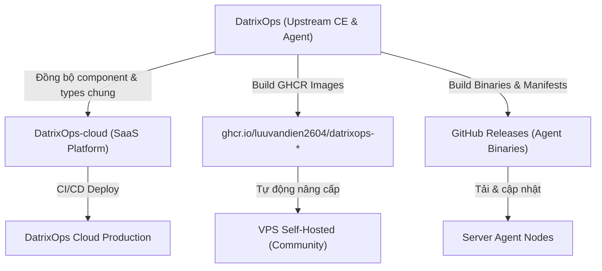

> **Important:** Tài liệu nội bộ dành cho đội ngũ phát triển và vận hành DatrixOps. Yêu cầu đăng nhập tài khoản trên DatrixOps Cloud để truy cập.

Tài liệu này quy định chuẩn hóa toàn bộ vòng đời phát triển phần mềm (SDLC), quy trình release và triển khai cho 3 thành phần chính của hệ sinh thái DatrixOps: **DatrixOps Community Edition (CE)**, **DatrixOps Agent** và **DatrixOps Cloud Edition**.

---

## 1. Cấu trúc hệ thống và phân tách mã nguồn

Hệ sinh thái DatrixOps được tổ chức thành 2 kho lưu trữ (Repository) độc lập:

| Repository | Thành phần | Mô tả & Trách nhiệm |
| :--- | :--- | :--- |
| **`DatrixOps`** | CE Server & Agent | Mã nguồn mở Community Edition (Backend, Frontend, Migration, Worker) và Agent đa nền tảng (Linux, macOS, Windows). |
| **`DatrixOps-cloud`** | Cloud SaaS Platform | Nền tảng SaaS quản lý tập trung, mở rộng với Multi-tenancy, Workspaces, Team RBAC, Subscription/Billing, Global Notifications. |



---

## 2. Quy trình sửa đổi và phát hành trên Community Edition (CE)

Áp dụng khi sửa lỗi (bugfix), tinh chỉnh UI/UX, nâng cấp API hoặc bổ sung tính năng mới cho bản CE:

### Bước 1: Phát triển & Kiểm thử cục bộ
Trước khi tạo commit, bắt buộc chạy bộ kiểm tra chất lượng mã nguồn:
```bash
# 1. Kiểm tra Backend (Go)
cd backend
gofmt -w .
go test ./...
go test -race ./...
go vet ./...

# 2. Kiểm tra Frontend (Next.js & TypeScript)
cd ../frontend
npm run lint
npm run typecheck
npm run build
```

### Bước 2: Cập nhật phiên bản (Release Bump)
Khi chuẩn bị phát hành phiên bản mới (ví dụ từ `v1.8.0` lên `v1.8.1`):
1. Cập nhật `deploy/version.json`:
   ```json
   {
     "version": "1.8.1",
     "agent_version": "1.5.9",
     "release_date": "2026-08-26"
   }
   ```
2. Cập nhật `APP_VERSION` fallback trong `frontend/src/lib/edition.ts`:
   ```ts
   export const APP_VERSION = process.env.NEXT_PUBLIC_DATRIXOPS_VERSION || '1.8.1';
   ```
3. Cập nhật biến môi trường mẫu trong `deploy/.env.example` và `.env.example`.

### Bước 3: Đẩy mã nguồn & Gắn Git Tag
* **Phát hành bản chính thức:**
  ```bash
  git add .
  git commit -m "chore(release): prepare CE Server v1.8.1"
  git push origin main
  git tag -a "v1.8.1" -m "DatrixOps CE v1.8.1"
  git push origin "v1.8.1"
  ```
* **Kích hoạt tự động:** GitHub Actions `.github/workflows/docker-publish.yml` sẽ tự động build và push các Docker container images:
  * `ghcr.io/luuvandien2604/datrixops-backend:1.8.1`
  * `ghcr.io/luuvandien2604/datrixops-frontend:1.8.1`
  * `ghcr.io/luuvandien2604/datrixops-worker:1.8.1`
  * `ghcr.io/luuvandien2604/datrixops-migrate:1.8.1`

### Bước 4: Triển khai trên máy chủ CE (Production/VPS)
Trên máy chủ VPS tự host:
```bash
cd /opt/datrixops/deploy
# Cách 1: Sử dụng script upgrade tự động (tự backup, kéo image, migrate DB)
sudo ./upgrade.sh

# Cách 2: Thủ công với docker compose
docker compose pull
docker compose up -d --force-recreate
```

---

## 3. Quy trình phát triển và nâng cấp DatrixOps Agent

Agent chạy trực tiếp trên máy chủ của người dùng, yêu cầu độ ổn định cao, tính tương thích ngược và chữ ký bảo mật.

### Bước 1: Phát triển & Unit Tests
Mã nguồn Agent nằm tại thư mục `agent/`:
```bash
cd agent
go test ./...
go test -race ./...
```

### Bước 2: Biên dịch đa nền tảng (Cross-Platform Compilation)
Agent được biên dịch cho các kiến trúc mục tiêu:
```bash
# Linux amd64 & arm64
CGO_ENABLED=0 GOOS=linux GOARCH=amd64 go build -trimpath -ldflags="-s -w" -o bin/datrixops-agent-linux-amd64 ./cmd/agent
CGO_ENABLED=0 GOOS=linux GOARCH=arm64 go build -trimpath -ldflags="-s -w" -o bin/datrixops-agent-linux-arm64 ./cmd/agent

# macOS (Darwin) amd64 & arm64
CGO_ENABLED=0 GOOS=darwin GOARCH=amd64 go build -trimpath -ldflags="-s -w" -o bin/datrixops-agent-darwin-amd64 ./cmd/agent
CGO_ENABLED=0 GOOS=darwin GOARCH=arm64 go build -trimpath -ldflags="-s -w" -o bin/datrixops-agent-darwin-arm64 ./cmd/agent

# Windows amd64
CGO_ENABLED=0 GOOS=windows GOARCH=amd64 go build -trimpath -ldflags="-s -w" -o bin/datrixops-agent-windows-amd64.exe ./cmd/agent
```

### Bước 3: Tạo Checksum và Ký Release Manifest
1. Tạo checksum SHA-256 cho từng binary.
2. Tạo file `manifest.json` ghi nhận phiên bản, checksum và thời gian phát hành.
3. Ký `manifest.json` bằng khóa bảo mật Ed25519 tạo ra file `manifest.sig`.

### Bước 4: Phát hành Agent Release
1. Tạo GitHub Release với tag `agent-vX.Y.Z` (hoặc `vX.Y.Z`) đính kèm toàn bộ binaries và manifest.
2. Cập nhật `AGENT_VERSION` trên Backend Control Plane.
3. Khi Control Plane nhận phiên bản mới, Dashboard sẽ hiển thị thông báo **Update available**. Quản trị viên có thể bấm **Update all agents** hoặc Agent sẽ tự nâng cấp nếu bật auto-update policy.

---

## 4. Quy trình phát triển trên DatrixOps Cloud (`DatrixOps-cloud`)

`DatrixOps-cloud` là nền tảng SaaS mở rộng từ lõi CE với các thành phần kinh doanh chuyên sâu:

### Bước 1: Đồng bộ file dùng chung từ Upstream CE
Mỗi khi CE có cập nhật các kiểu dữ liệu (Types), API models hoặc core components, chạy script kiểm tra đồng bộ trong repo Cloud:
```bash
cd DatrixOps-cloud
bash scripts/verify-upstream-shared-files.sh
```

### Bước 2: Phát triển các tính năng Cloud-only
Các tính năng độc quyền của Cloud bao gồm:
* **Multi-tenant Workspaces:** Phân lập dữ liệu hoàn toàn giữa các doanh nghiệp / tổ chức.
* **Team RBAC:** Mời thành viên qua email, phân quyền granular (Owner, Admin, Operator, Viewer).
* **Billing & Subscriptions:** Quản lý gói dịch vụ, hạn mức server, cổng thanh toán.
* **Global Notifications & SSO:** Tích hợp SAML/OIDC và webhook định tuyến thông minh.

### Bước 3: CI/CD Pipeline & Deploy Cloud Managed
* Mỗi Pull Request vào `DatrixOps-cloud` được kiểm tra tự động qua `.github/workflows/ci.yml`.
* Khi merge vào `main`, hệ thống CI/CD tự động deploy bản build mới lên hạ tầng cụm Cloud Managed qua Kubernetes / Docker Swarm mà không gây downtime (Zero-downtime rolling update).

---

## 5. Bảng Checklist kiểm thử trước khi Release

Trước khi phát hành bất kỳ phiên bản nào, kiểm tra qua bảng checklist sau:

- [ ] **Code Formatting:** `gofmt` và `npm run lint` sạch 100%, không có warning thừa.
- [ ] **Type Checking:** `npm run typecheck` thành công không có lỗi type nào.
- [ ] **Race Condition Check:** `go test -race ./...` vượt qua toàn bộ test suites.
- [ ] **Build Validation:** `docker compose config` hợp lệ, build production image không có lỗi.
- [ ] **Version Consistency:** `deploy/version.json`, `edition.ts`, `.env.example` đồng nhất phiên bản.
- [ ] **Backward Compatibility:** Database migrations có tính lũy tiến, không làm gián đoạn các node Agent phiên bản cũ.
