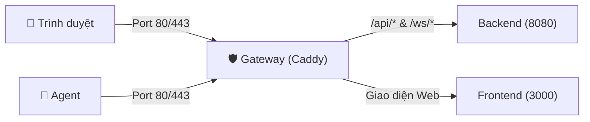

DatrixOps Community Edition (CE) là phiên bản mã nguồn mở tự host hoàn chỉnh, bao gồm **Control Plane** quản trị tập trung và **DatrixOps Agent** cài đặt trên các máy chủ cần giám sát. Toàn bộ cơ sở dữ liệu PostgreSQL, số liệu telemetry, logs và lịch sử audit hoàn toàn nằm trên hạ tầng của bạn.

---

## 1. Yêu cầu hệ thống

| Tài nguyên | Khuyến nghị tối thiểu | Ghi chú |
| :--- | :--- | :--- |
| **Hệ điều hành** | Ubuntu 20.04+, Debian 11+, CentOS/RHEL 8+, AlmaLinux, Rocky Linux | Kiến trúc `x86_64` (amd64) hoặc `aarch64` (arm64) |
| **CPU** | 1 Core | 2 Cores nếu giám sát > 50 máy chủ |
| **RAM** | 2 GB | Tối thiểu 1.5 GB khả dụng |
| **Ổ cứng** | 20 GB SSD | Tùy thuộc vào thời gian lưu trữ metrics |
| **Cổng mạng (Inbound)** | `80/TCP`, `443/TCP` | Mở trên Firewall / Security Group (AWS/GCP/DigitalOcean/Vietnix) |

---

## 2. Cài đặt tự động trong 1 lệnh

Đăng nhập vào VPS với quyền `root` hoặc `sudo` và chạy lệnh:

```bash
curl -fsSL https://raw.githubusercontent.com/luuvandien2604/DatrixOps/main/deploy/bootstrap.sh | sudo bash
```

### Trình cài đặt tự động xử lý:
1. **Kiểm tra môi trường:** Cài đặt `docker`, `docker compose`, `curl`, `openssl`, `jq` nếu máy chủ chưa có.
2. **Lựa chọn chế độ truy cập:**
   * **Public IP (Mặc định):** Truy cập qua `http://<IP_VPS>` (cổng 80 tiêu chuẩn).
   * **Custom Domain:** Nhập domain riêng (ví dụ `monitor.example.com`). Hệ thống tự động cấp phát và gia hạn chứng chỉ **HTTPS / SSL miễn phí** qua Caddy Gateway.
3. **Cấu hình Quản trị viên:** Thiết lập username quản trị (mặc định `admin`) và mật khẩu an toàn (tự đặt hoặc tự động sinh).
4. **Tự động kích hoạt Self-Monitoring:** Cài đặt Agent và kết nối ngay chính VPS Control Plane vào Dashboard để giám sát tài nguyên tức thì.
5. **Đăng ký lệnh quản trị `datrix`:** Tạo symlink toàn cục tại `/usr/local/bin/datrix`.

---

## 3. Kiến trúc Caddy Gateway & Quản lý SSL Tự động

Hệ thống sử dụng **Caddy 2** làm cửa ngõ tiếp nhận duy nhất cho toàn bộ traffic bên ngoài:



### Điểm đặc biệt của Caddy Gateway:
- **Zero-Config Automatic HTTPS:** Khi bạn nhập tên miền vào `CADDY_SITE_ADDRESS`, Caddy tự động liên hệ với Let's Encrypt hoặc ZeroSSL qua giao thức ACME để xin chứng chỉ SSL/TLS mà không cần cài Certbot hay cấu hình cronjob.
- **Tự động gia hạn:** Caddy tự động gia hạn chứng chỉ trước khi hết hạn 30 ngày trong bộ nhớ và nạp lại ngay lập tức mà không gây downtime.
- **Lưu trữ an toàn:** Chứng chỉ được lưu trong Docker Volume `caddy_data` (tại `/data/caddy/certificates/...`). Khi nâng cấp hoặc khởi động lại container, chứng chỉ vẫn được bảo toàn nguyên vẹn.
- **Hỗ trợ HTTP/3 (QUIC):** Caddy tự động kích hoạt port `443/udp` giúp giảm độ trễ tối đa cho các kết nối Web Dashboard và WebSocket.

---

## 4. Quản lý cấu hình: Cơ chế Single `.env` File (Source of Truth)

DatrixOps áp dụng nguyên tắc **Duy nhất một file cấu hình gốc**:

- **File gốc chính thức:** `/opt/datrixops/.env`
- **Cơ chế Symlink tự động:** Thư mục `/opt/datrixops/deploy/.env` được liên kết bằng symlink trỏ về `/opt/datrixops/.env`:
  ```text
  /opt/datrixops/deploy/.env -> /opt/datrixops/.env
  ```
- **Lợi ích:**
  - Toàn bộ dịch vụ (Caddy, Backend, Frontend, Worker, Database) đều đọc chung một file `.env` duy nhất.
  - Bất kể bạn chạy lệnh `datrix` ở thư mục gốc hay gõ lệnh tay `docker compose` trong thư mục `deploy/`, hệ thống đều nạp cùng một cấu hình, triệt tiêu hoàn toàn nguy cơ lệch biến môi trường.

---

## 5. Quản trị hệ thống với CLI `datrix`

Sau khi cài đặt xong, bạn có thể quản trị toàn bộ hệ thống bằng lệnh `datrix` trực tiếp trong terminal.

### 📋 Menu Quản trị Tương tác

Gõ lệnh không kèm tham số để mở bảng điều khiển:

```bash
datrix
```
*(Hoặc `sudo datrix` nếu đang dùng tài khoản user thường)*

### ⚡ Các lệnh CLI trực tiếp (Non-interactive)

| Lệnh CLI | Chức năng | Ví dụ |
| :--- | :--- | :--- |
| `datrix info` | Xem URL đăng nhập, phiên bản CE Server & Agent, tên tài khoản Admin | `datrix info` |
| `datrix status` | Kiểm tra trạng thái các container Docker và dịch vụ Agent | `datrix status` |
| `datrix reset-password` | Đổi mật khẩu tài khoản quản trị viên an toàn | `datrix reset-password admin` |
| `datrix logs` | Xem stream log thời gian thực của tất cả container (Ctrl+C để thoát) | `datrix logs` |
| `datrix restart` | Khởi động lại toàn bộ các container và dịch vụ Agent | `datrix restart` |
| `datrix update` | Tự động sao lưu và nâng cấp lên phiên bản CE mới nhất | `datrix update` |
| `datrix backup` | Tạo bản sao lưu toàn diện (Database + Cấu hình `.env`) | `datrix backup` |
| `datrix help` | Xem danh sách hướng dẫn lệnh | `datrix help` |

---

## 6. Nâng cấp phiên bản & Tối ưu dung lượng (Upgrades & Cleanup)

Quy trình nâng cấp của DatrixOps hoàn toàn tự động và luôn **tạo backup an toàn trước khi nâng cấp**.

### Nâng cấp trực tiếp qua CLI:
```bash
sudo datrix update
```

### Cơ chế dọn dẹp dung lượng tự động sau nâng cấp:
1. **Lọc theo nhãn Compose (Docker Label Filter):** Chỉ xử lý các container và image thuộc nhãn `com.docker.compose.project=datrixops`, tuyệt đối không ảnh hưởng đến các container khác của người dùng trên cùng VPS.
2. **Bảo tồn an toàn N-1 (Safe Retention):** Giữ lại image phiên bản liền trước ($N-1$) để hỗ trợ rollback tức thì nếu có sự cố, đồng thời dọn dẹp các bản build image cũ hơn.
3. **Dọn dẹp Build Cache & Dangling Layers:** Tự động giải phóng các tầng layer rác và cache cũ hơn 7 ngày, giúp tiết kiệm từ 10 GB - 30 GB dung lượng ổ cứng.
4. **Worker Retention Job:** Worker tự động dọn dẹp định kỳ các bản ghi telemetry cũ dựa trên tham số `METRICS_RETENTION_DAYS` (mặc định 7 ngày).

---

## 7. Sao lưu & Khôi phục (Backup & Disaster Recovery)

### Tạo bản sao lưu (Backup)
```bash
sudo datrix backup
```
File backup `.tar.gz` được lưu tại `/opt/datrixops/backups/`, chứa toàn bộ:
1. `database.dump`: Dump nhị phân toàn bộ cơ sở dữ liệu PostgreSQL.
2. `environment.env`: Bản sao cấu hình bí mật (`JWT_SECRET`, `POSTGRES_PASSWORD`, `SETUP_TOKEN`...).
3. `manifest.txt`: Metadata thời gian và version git.

### Khôi phục dữ liệu (Restore)
```bash
sudo /opt/datrixops/deploy/restore.sh /opt/datrixops/backups/datrixops-backup-YYYY-MM-DD-HHMMSS.tar.gz --yes
```

---

## 8. Các biến môi trường quan trọng (`.env`)

| Biến môi trường | Mặc định | Mô tả |
| :--- | :--- | :--- |
| `PUBLIC_URL` | `http://<IP>` hoặc `https://<domain>` | URL chính thức để truy cập Dashboard |
| `CADDY_SITE_ADDRESS` | `http://<IP>` hoặc `<domain>` | Cấu hình cho Caddy Gateway tự động cấp SSL |
| `DATRIXOPS_HTTP_PORT` | `80` | Cổng HTTP lắng nghe bên ngoài host VPS |
| `DATRIXOPS_HTTPS_PORT` | `443` | Cổng HTTPS lắng nghe bên ngoài host VPS |
| `METRICS_RETENTION_DAYS` | `7` | Số ngày lưu trữ chuỗi chỉ số CPU/RAM/Network |
| `OPERATIONAL_RETENTION_DAYS`| `90` | Số ngày lưu trữ nhật ký kiểm toán và sự cố |
