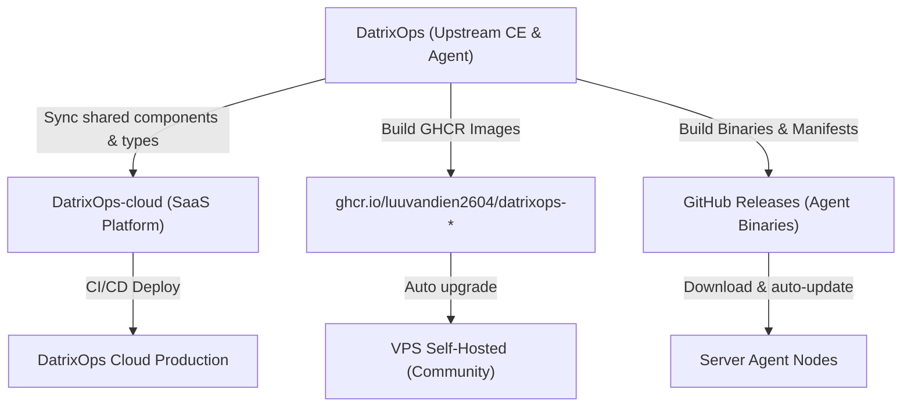

> **Important:** Internal documentation for the DatrixOps engineering and operations team. Requires an active authenticated session on DatrixOps Cloud.

This document establishes standard operating procedures for the software development life cycle (SDLC), release management, and deployment pipelines across **DatrixOps Community Edition (CE)**, **DatrixOps Agent**, and **DatrixOps Cloud Edition**.

---

## 1. System Architecture & Codebase Split

The DatrixOps ecosystem is split into two independent repositories:

| Repository | Component | Scope & Responsibilities |
| :--- | :--- | :--- |
| **`DatrixOps`** | CE Server & Agent | Open-source Community Edition (Backend, Frontend, Migration, Worker) and cross-platform Agent (Linux, macOS, Windows). |
| **`DatrixOps-cloud`** | Cloud SaaS Platform | Multi-tenant SaaS platform extending CE with Workspaces, Team RBAC, Subscription/Billing, and Global Notifications. |



---

## 2. Community Edition (CE) Update & Release Procedure

Follow this workflow for bug fixes, UI/UX improvements, API enhancements, or core features in CE:

### Step 1: Local Development & Quality Gates
Before creating commits, run the full validation suite:
```bash
# 1. Backend tests (Go)
cd backend
gofmt -w .
go test ./...
go test -race ./...
go vet ./...

# 2. Frontend tests (Next.js & TypeScript)
cd ../frontend
npm run lint
npm run typecheck
npm run build
```

### Step 2: Version Bump
When releasing a new version (e.g. from `v1.8.0` to `v1.8.1`):
1. Update `deploy/version.json`:
   ```json
   {
     "version": "1.8.1",
     "agent_version": "1.5.9",
     "release_date": "2026-08-26"
   }
   ```
2. Update the fallback `APP_VERSION` in `frontend/src/lib/edition.ts`:
   ```ts
   export const APP_VERSION = process.env.NEXT_PUBLIC_DATRIXOPS_VERSION || '1.8.1';
   ```
3. Update version strings in `deploy/.env.example` and `.env.example`.

### Step 3: Git Commit & Tagging
* **Release commit and tag:**
  ```bash
  git add .
  git commit -m "chore(release): prepare CE Server v1.8.1"
  git push origin main
  git tag -a "v1.8.1" -m "DatrixOps CE v1.8.1"
  git push origin "v1.8.1"
  ```
* **Automated Publishing:** GitHub Actions `.github/workflows/docker-publish.yml` automatically builds and pushes the images:
  * `ghcr.io/luuvandien2604/datrixops-backend:1.8.1`
  * `ghcr.io/luuvandien2604/datrixops-frontend:1.8.1`
  * `ghcr.io/luuvandien2604/datrixops-worker:1.8.1`
  * `ghcr.io/luuvandien2604/datrixops-migrate:1.8.1`

### Step 4: Self-Hosted Production Upgrade
On the self-hosted VPS:
```bash
cd /opt/datrixops/deploy
# Option 1: Automated upgrade script (backups database, pulls images, runs migrations)
sudo ./upgrade.sh

# Option 2: Manual docker compose recreation
docker compose pull
docker compose up -d --force-recreate
```

---

## 3. DatrixOps Agent Release Workflow

The Agent runs directly on target hosts, requiring strict backward compatibility, Ed25519 signature verification, and zero disruption.

### Step 1: Agent Unit & Integration Tests
```bash
cd agent
go test ./...
go test -race ./...
```

### Step 2: Cross-Platform Matrix Compilation
```bash
# Linux amd64 & arm64
CGO_ENABLED=0 GOOS=linux GOARCH=amd64 go build -trimpath -ldflags="-s -w" -o bin/datrixops-agent-linux-amd64 ./cmd/agent
CGO_ENABLED=0 GOOS=linux GOARCH=arm64 go build -trimpath -ldflags="-s -w" -o bin/datrixops-agent-linux-arm64 ./cmd/agent

# macOS (Darwin) amd64 & arm64
CGO_ENABLED=0 GOOS=darwin GOARCH=amd64 go build -trimpath -ldflags="-s -w" -o bin/datrixops-agent-darwin-amd64 ./cmd/agent
CGO_ENABLED=0 GOOS=darwin GOARCH=arm64 go build -trimpath -ldflags="-s -w" -o bin/datrixops-agent-darwin-arm64 ./cmd/agent

# Windows amd64
CGO_ENABLED=0 GOOS=windows GOARCH=amd64 go build -trimpath -ldflags="-s -w" -o bin/datrixops-agent-windows-amd64.exe ./cmd/agent
```

### Step 3: Checksums & Signature Generation
1. Compute SHA-256 checksums for each binary.
2. Generate `manifest.json` containing version, artifact URLs, and hashes.
3. Sign `manifest.json` with the Ed25519 private key producing `manifest.sig`.

### Step 4: Publishing Release
1. Create a GitHub Release with tag `agent-vX.Y.Z` attaching all binaries, checksums, and signed manifests.
2. Update `AGENT_VERSION` on the Control Plane backend.
3. The Control Plane signals **Update available** in the dashboard. Operators can trigger **Update all agents** or rely on automated update policies.

---

## 4. Cloud Platform (`DatrixOps-cloud`) Workflow

`DatrixOps-cloud` extends the CE core with enterprise SaaS capabilities:

### Step 1: Upstream Sync Check
When CE shared models or components change, verify synchronization in the Cloud repository:
```bash
cd DatrixOps-cloud
bash scripts/verify-upstream-shared-files.sh
```

### Step 2: Cloud-Specific Feature Engineering
* **Multi-tenant Workspaces:** Complete data isolation between organizations.
* **Team RBAC:** Email invitations, granular role assignments (Owner, Admin, Operator, Viewer).
* **Subscription & Billing:** Payment gateway integration, tier limits, and quota enforcement.
* **Global Notifications & SSO:** SAML/OIDC authentication and intelligent notification routing.

### Step 3: CI/CD & Zero-Downtime Deployment
* Pull Requests run automated lint and unit testing through `.github/workflows/ci.yml`.
* Merges to `main` trigger automated rolling deployments to managed production clusters without service disruption.

---

## 5. Pre-Release Quality Checklist

Ensure all items are verified prior to promoting any release to production:

- [ ] **Formatting:** Clean `gofmt` and `npm run lint` with zero errors.
- [ ] **Type Safety:** `npm run typecheck` passes with no type discrepancies.
- [ ] **Concurrency:** `go test -race ./...` completes cleanly.
- [ ] **Container Validation:** `docker compose config` validates without configuration warnings.
- [ ] **Version Alignment:** `version.json`, `edition.ts`, and `.env.example` are strictly identical.
- [ ] **Backward Compatibility:** Database migrations are strictly additive and non-breaking.
