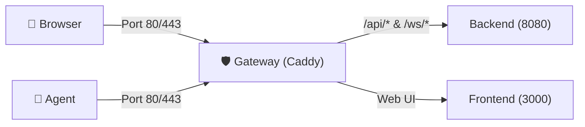

DatrixOps Community Edition (CE) is a fully self-hosted, open-source server monitoring control plane. All PostgreSQL database records, telemetry time-series, logs, and audit histories remain strictly on your own infrastructure.

---

## 1. System Requirements

| Resource | Recommended Minimum | Notes |
| :--- | :--- | :--- |
| **Operating System** | Ubuntu 20.04+, Debian 11+, CentOS/RHEL 8+, AlmaLinux, Rocky Linux | `x86_64` (amd64) or `aarch64` (arm64) architecture |
| **CPU** | 1 Core | 2 Cores if monitoring > 50 servers |
| **RAM** | 2 GB | Minimum 1.5 GB available |
| **Disk** | 20 GB SSD | Depends on metrics retention settings |
| **Network Ports (Inbound)**| `80/TCP`, `443/TCP` | Open on your firewall or cloud security group |

---

## 2. Automated 1-Line Installation

Log into your server as `root` (or with `sudo`) and run:

```bash
curl -fsSL https://raw.githubusercontent.com/luuvandien2604/DatrixOps/main/deploy/bootstrap.sh | sudo bash
```

### The automated installer handles:
1. **Prerequisites Verification:** Installs `docker`, `docker compose`, `curl`, `openssl`, and `jq` if missing.
2. **Access Mode Selection:**
   * **Public IP (Default):** Accessible via `http://<SERVER_IP>` on standard port 80.
   * **Custom Domain:** Provide a custom domain (e.g. `monitor.example.com`). The system automatically provisions and renews **free HTTPS/SSL certificates** via Caddy Gateway.
3. **Administrator Credentials:** Configures the primary administrator account securely.
4. **Automated Host Self-Monitoring:** Enrolls the Control Plane VPS itself as the first monitored node.
5. **Registers `datrix` CLI:** Creates a system-wide binary shortcut at `/usr/local/bin/datrix`.

---

## 3. Caddy Gateway Architecture & Automatic HTTPS

DatrixOps uses **Caddy 2** as the sole ingress reverse proxy for all external traffic:



### Key Gateway Advantages:
- **Zero-Config Automatic HTTPS:** By configuring `CADDY_SITE_ADDRESS` with your domain, Caddy interfaces directly with Let's Encrypt or ZeroSSL using the ACME protocol. No certbot cronjobs required.
- **Seamless Renewal:** Renews certificates automatically 30 days prior to expiration in memory with zero downtime.
- **Persistent Volume:** Certificates and keys are stored safely inside the `caddy_data` volume (`/data/caddy/certificates/...`) and preserved across container upgrades.
- **HTTP/3 (QUIC) Enabled:** Caddy exposes `443/udp` for high-throughput, low-latency dashboard and WebSocket connectivity.

---

## 4. Configuration: Single `.env` Source of Truth

DatrixOps enforces an immutable **Single Source of Truth** for configuration:

- **Master Configuration File:** `/opt/datrixops/.env`
- **Automatic Symlink:** The deploy directory symlink points directly to the root `.env`:
  ```text
  /opt/datrixops/deploy/.env -> /opt/datrixops/.env
  ```
- **Benefits:**
  - All services (Caddy, Backend, Frontend, Worker, Database) consume the identical configuration.
  - Whether running `datrix` commands or native `docker compose` commands inside `deploy/`, configuration drift is completely eliminated.

---

## 5. System Administration with `datrix` CLI

Manage the entire installation directly from your terminal:

```bash
sudo datrix
```

### Direct CLI Commands

| Command | Description | Example |
| :--- | :--- | :--- |
| `datrix info` | Show login URL, server & agent versions, admin username | `datrix info` |
| `datrix status` | Inspect status of all Docker containers and Agent service | `datrix status` |
| `datrix reset-password` | Safely change the administrator password | `datrix reset-password admin` |
| `datrix logs` | Tail real-time service logs (Ctrl+C to exit) | `datrix logs` |
| `datrix restart` | Restart all containers and the local Agent service | `datrix restart` |
| `datrix update` | Perform automated backup and upgrade to the latest CE release | `datrix update` |
| `datrix backup` | Generate a full backup archive (Database + `.env`) | `datrix backup` |

---

## 6. Upgrades & Storage Optimization

Upgrades run seamlessly with automatic pre-upgrade backups:

```bash
sudo datrix update
```

### Post-Upgrade Storage Cleanup:
1. **Compose Project Label Filtering:** Only touches images matching `com.docker.compose.project=datrixops`, protecting unrelated containers on the host.
2. **Safe $N-1$ Image Retention:** Retains the immediately preceding release image to enable instant rollback if needed.
3. **Build Cache & Dangling Layer Pruning:** Cleans dangling layers and build caches older than 7 days, freeing 10 GB - 30 GB of disk space.
4. **Worker Metrics Retention:** Automatically purges metrics older than `METRICS_RETENTION_DAYS` (default 7 days).

---

## 7. Backup & Disaster Recovery

### Creating a Backup
```bash
sudo datrix backup
```
The archive is saved under `/opt/datrixops/backups/`, containing `database.dump`, `environment.env`, and `manifest.txt`.

### Restoring from Backup
```bash
sudo /opt/datrixops/deploy/restore.sh /opt/datrixops/backups/datrixops-backup-YYYY-MM-DD-HHMMSS.tar.gz --yes
```

---

## 8. Important Environment Variables (`.env`)

| Variable | Default | Description |
| :--- | :--- | :--- |
| `PUBLIC_URL` | `http://<IP>` or `https://<domain>` | Canonical base URL for dashboard access |
| `CADDY_SITE_ADDRESS` | `http://<IP>` or `<domain>` | Domain/IP configuration for Caddy Gateway |
| `DATRIXOPS_HTTP_PORT` | `80` | Host port for HTTP traffic |
| `DATRIXOPS_HTTPS_PORT` | `443` | Host port for HTTPS traffic |
| `METRICS_RETENTION_DAYS` | `7` | Retention window for CPU, RAM, and network metrics |
| `OPERATIONAL_RETENTION_DAYS`| `90` | Retention window for audit logs and incidents |
