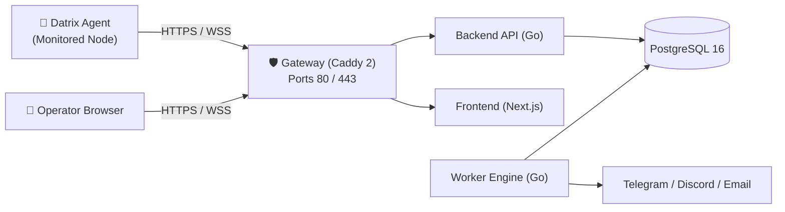

**DatrixOps** is a modern, distributed server monitoring and control plane platform designed for DevOps engineers, system administrators, and infrastructure teams. Instead of manually SSHing into individual servers, DatrixOps unifies system resource telemetry, network quality diagnostics, processes, OS services, Docker containers, and alerting into a single intuitive dashboard.

---

## 1. Core Capabilities

- **Real-Time Resource Telemetry:** Live tracking of CPU load, RAM utilization, Disk capacity, Disk I/O, and Network throughput.
- **Network Quality Diagnostics:** Dedicated ICMP/TCP latency measurements, packet loss analysis, local gateway uplink tracking, and dynamic tag grouping (Domestic, International, DNS, Database).
- **Multi-Channel Alert Center:** Instant notifications via Telegram Bot, Discord Webhooks, or SMTP Email when resource thresholds are breached or heartbeats are lost, featuring automatic recovery (Auto-Resolve) notifications.
- **Website & SSL Certificate Monitoring:** Continuously tracks HTTP availability, response times, and certificate expiry countdowns.
- **Secure Web Terminal & Remote Operations:** Headless Linux shell directly in your browser over secure Reverse WebSockets without requiring open inbound SSH ports on client hosts.
- **Docker & Service Management:** Container lifecycle controls (restart, stop) and native OS service discovery (systemd, launchd, Windows services).
- **Cryptographically Signed Agent Updates:** Streamlined remote agent fleet upgrades verified via Ed25519 signatures and SHA-256 checksums.

---

## 2. Architecture Overview

DatrixOps uses a clean separation between the central Control Plane and distributed Edge Agents:

| Component | Responsibility |
| :--- | :--- |
| **Gateway (Caddy 2)** | Single external entrypoint on ports 80/443. Manages automatic SSL/TLS certificate lifecycle and securely proxies internal traffic. |
| **Frontend (Next.js 16)** | High-performance dashboard, real-time charts, server administration, web terminal, and alert management. |
| **Backend API (Go)** | User authentication, Agent API, metric and network probe ingestion, enrollment token lifecycle, and WebSocket terminal relay. |
| **Worker Engine (Go)** | Background asynchronous jobs: website health probing, alert rule evaluation, notification dispatch, and metrics retention cleanup. |
| **Database (PostgreSQL 16)** | Stores relational configuration, telemetry time-series, network probe results, incidents, and audit trails. |
| **Datrix Agent (Go Daemon)** | Ultra-lightweight background service running on client nodes, communicating exclusively via outbound HTTPS/WSS connections. |

> **Important:** The Datrix Agent is **strictly outbound-only**. You **do not need to open any inbound ports** on monitored client machines.

---

## 3. Supported Platforms

The Datrix Agent is cross-compiled as a native static binary:
- **Linux:** `amd64` (x86_64) and `arm64` (aarch64). Fully compatible with Ubuntu, Debian, CentOS, RHEL, AlmaLinux, Rocky Linux, and Alpine Linux.
- **macOS:** Intel (`amd64`) and Apple Silicon (`arm64`).
- **Windows:** `amd64` (Windows Server, Windows 10/11 via Service Control Manager).

---

## 4. System Requirements

### Control Plane Server (DatrixOps Server)
- 1 CPU, 2 GB RAM, 20 GB SSD.
- Ports `80/TCP` and `443/TCP` reachable on public interfaces.
- Linux OS with Docker & Docker Compose installed.

### Monitored Client Server (Agent)
- Outbound HTTPS network access to the DatrixOps Control Plane.
- `root` (Linux/macOS) or Administrator (Windows) privileges for background service installation.
