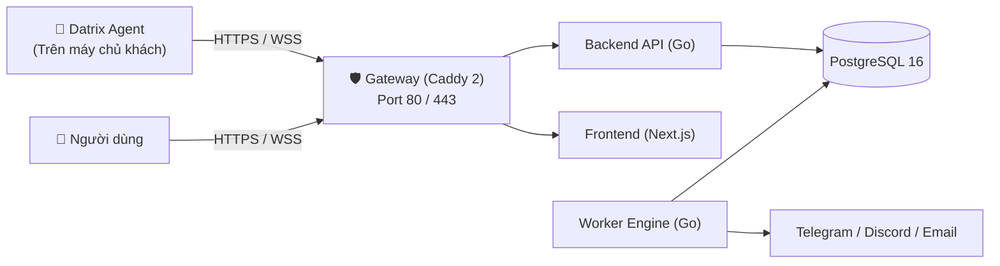

**DatrixOps** là nền tảng quản trị và giám sát hạ tầng máy chủ phân tán (Distributed Control Plane & Edge Agent), được thiết kế tối ưu cho DevOps, quản trị viên hệ thống và doanh nghiệp. Thay vì phải đăng nhập SSH vào từng máy chủ để kiểm tra, DatrixOps tập trung toàn bộ chỉ số tài nguyên, chẩn đoán chất lượng mạng, tiến trình, dịch vụ hệ thống, Docker container và cảnh báo sự cố về một Dashboard duy nhất.

---

## 1. Năng lực cốt lõi của DatrixOps

- **Giám sát tài nguyên thời gian thực:** Theo dõi tải CPU, RAM, dung lượng Disk, Disk I/O và băng thông mạng (Network Throughput).
- **Chẩn đoán chất lượng mạng chuyên sâu (Network Quality Diagnostics):** Đo lường độ trễ ICMP/TCP, tỷ lệ rớt gói (packet loss), Gateway uplink nội bộ và chẩn đoán theo các nhóm tag động (Trong nước, Quốc tế, DNS, Database).
- **Trung tâm cảnh báo đa kênh (Alert Center):** Tự động phát hiện vi phạm ngưỡng tài nguyên, rớt mạng hoặc mất heartbeat và thông báo tức thì qua Telegram Bot, Discord Webhook hoặc SMTP Email với tính năng Auto-Resolve khi phục hồi.
- **Giám sát Website & SSL Uptime:** Đo lường tính khả dụng, mã trạng thái HTTP và cảnh báo trước hạn chứng chỉ SSL/TLS.
- **Web Terminal & Thao tác từ xa an toàn:** Mở console terminal Linux trực tiếp trên trình duyệt qua kết nối Reverse WebSocket bảo mật, không cần mở port SSH inbound trên máy khách.
- **Quản lý Docker & Dịch vụ hệ thống:** Xem chi tiết trạng thái, điều khiển khởi động/dừng container và services (systemd, launchd, windows services).
- **Cập nhật Agent có chữ ký số:** Quản lý vòng đời và nâng cấp Agent từ xa với xác thực chữ ký số Ed25519 và kiểm tra mã băm SHA-256.

---

## 2. Kiến trúc các thành phần

Hệ thống hoạt động theo mô hình Control Plane kết hợp Edge Agent phân tán:

| Thành phần | Trách nhiệm chính |
| :--- | :--- |
| **Gateway (Caddy 2)** | Điểm tiếp nhận traffic duy nhất mở ra Internet (Port 80/443). Tự động cấp phát và gia hạn SSL/TLS, reverse proxy an toàn vào các container nội bộ. |
| **Frontend (Next.js 16)** | Giao diện bảng điều khiển hiện đại, biểu đồ thời gian thực, quản lý server, web terminal và cấu hình cảnh báo. |
| **Backend API (Go)** | Xử lý xác thực người dùng, API Agent, tiếp nhận telemetry/network probe results, quản lý enrollment token và phiên reverse terminal. |
| **Worker Engine (Go)** | Tiến trình xử lý ngầm: định kỳ kiểm tra website uptime, đánh giá quy tắc cảnh báo, gửi thông báo và tự động dọn dẹp dữ liệu cũ (retention cleanup). |
| **Database (PostgreSQL 16)** | Lưu trữ cấu hình hệ thống, chuỗi số liệu telemetry (metrics), mục tiêu mạng, sự cố và nhật ký kiểm toán (audit logs). |
| **Datrix Agent (Go Daemon)** | Ứng dụng chạy nền siêu nhẹ trên từng máy chủ cần giám sát, chủ động kết nối ra ngoài (Outbound-only) về Gateway. |

> **Important:** DatrixOps Agent hoạt động hoàn toàn theo cơ chế **Outbound-only**. Bạn **không cần mở bất kỳ port inbound nào** trên máy chủ khách. Mỗi server được cấp một Agent Token bí mật để xác thực khi gửi dữ liệu.

---

## 3. Nền tảng hỗ trợ

Agent của DatrixOps được biên dịch độc lập cho nhiều nền tảng:
- **Linux:** Kiến trúc `amd64` (x86_64) và `arm64` (aarch64). Tương thích Ubuntu, Debian, CentOS, RHEL, AlmaLinux, Rocky Linux, Alpine Linux.
- **macOS:** Intel (`amd64`) và Apple Silicon (`arm64`).
- **Windows:** Kiến trúc `amd64` (Windows Server, Windows 10/11 qua Service Control Manager).

---

## 4. Yêu cầu hệ thống

### Đối với máy chủ cài Control Plane (DatrixOps Server)
- 1 CPU, 2 GB RAM, 20 GB SSD.
- Mở cổng `80/TCP` và `443/TCP` trên tường lửa / Security Group.
- Hệ điều hành Linux có cài đặt Docker & Docker Compose.

### Đối với máy chủ cài Datrix Agent (Client)
- Kết nối mạng outbound HTTPS tới địa chỉ Control Plane.
- Quyền `root` (Linux/macOS) hoặc Administrator (Windows) để cài đặt service chạy nền.
